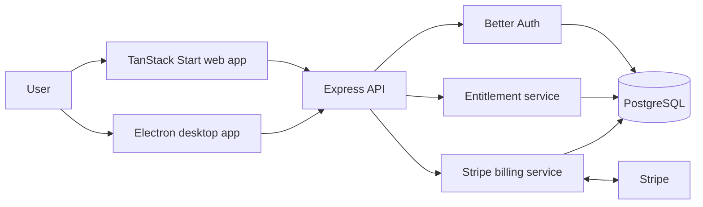

# DeskGate

DeskGate is a learning-focused SaaS project that demonstrates how a web application can sell, authenticate, license, and control access to an Electron desktop application.

It is intentionally built around the architecture of a subscription-based desktop product rather than a specific end-user problem. The project explores secure browser-based desktop sign-in, Stripe subscription handling, device management, and backend-enforced feature entitlements.

## What it demonstrates

- A pnpm TypeScript monorepo with shared packages.
- Browser-based authentication for Electron, using a custom `deskgate://` callback.
- Better Auth as the central identity and session system.
- Stripe billing and webhook-driven subscription synchronization.
- Plans, feature entitlements, and usage limits resolved by the backend.
- Registered desktop devices, session revocation, and secure main-process credential handling.
- Clear separation of authentication, entitlement resolution, and authorization.

## Architecture

The web and desktop apps are both clients of a single backend platform. The backend is the source of truth for accounts, sessions, subscriptions, entitlements, devices, and access decisions.



The Electron renderer may adapt its interface to the available features, but it is never trusted to authorize valuable actions. Server-backed operations must be authenticated and checked against the user’s current entitlement and usage limits.

## Desktop sign-in flow

1. The desktop app opens the system browser for sign-in.
2. The user signs in through the web application.
3. The backend issues a short-lived, one-time authorization code.
4. The browser redirects to `deskgate://auth/callback?code=...`.
5. Electron’s main process exchanges the code for a desktop session and stores the credential securely.
6. The desktop app requests a bootstrap payload containing subscription, device, and entitlement state.

Passwords and reusable session credentials should never be exposed to the Electron renderer.

## Plans and entitlements

| Capability            | Free |  Pro   |   Team    |
| --------------------- | :--: | :----: | :-------: |
| Desktop access        | Yes  |  Yes   |    Yes    |
| Maximum projects      |  2   |   25   | Unlimited |
| Cloud synchronization |  No  |  Yes   |    Yes    |
| Advanced export       |  No  |  Yes   |    Yes    |
| Team collaboration    |  No  |   No   |    Yes    |
| Activated devices     |  1   |   3    |    10     |
| Offline grace period  | None | 3 days |  7 days   |

Plan identity and subscription status are separate concerns. For example, a user can be on the Pro plan while access is restricted because their subscription has expired or payment is past due.

## Repository layout

```text
apps/
  api/          Express API, Better Auth, Stripe integration
  ui/           TanStack Start web application and shadcn/ui components
packages/
  config/       Shared configuration, including Stripe configuration
  database/     Prisma schema and PostgreSQL client helpers
  schemas/      Shared Zod schemas and environment validation
goal.md         Product, architecture, and security reference
```

The target architecture also includes an Electron desktop app plus shared auth, contracts, entitlement, and UI packages as the project evolves. See [goal.md](goal.md) for the complete reference design.

## Prerequisites

- Node.js 20 or later
- pnpm 11
- PostgreSQL
- A Stripe account for billing and webhook development

## Getting started

Install dependencies:

```bash
pnpm install
```

Configure local environment variables for the API, UI, database, Better Auth, and Stripe. Keep credentials in local `.env` files only; do not commit them.

Generate the Prisma client and apply the current schema to your development database:

```bash
pnpm db:generate
pnpm db:push
```

Start all application workspaces:

```bash
pnpm dev
```

The web UI runs on port `3000` by default.

## Useful commands

```bash
pnpm dev                 # Start application workspaces after building packages
pnpm build               # Build packages and applications
pnpm lint                # Run ESLint
pnpm format              # Check Prettier formatting
pnpm format:fix          # Apply Prettier formatting
pnpm db:generate         # Generate Prisma client
pnpm db:push             # Push the Prisma schema to the database
pnpm db:studio           # Open Prisma Studio
pnpm db:schema:generate  # Generate Better Auth database schema additions
```

## Security principles

- Use the system browser for authentication; do not embed password entry in Electron.
- Use random, short-lived, single-use authorization codes for desktop callbacks.
- Keep desktop credentials in secure main-process storage and expose only a small typed IPC surface to the renderer.
- Validate Stripe webhook signatures and synchronize subscription changes on the backend.
- Enforce subscriptions, entitlements, limits, device status, and minimum app versions on the backend.
- Treat the web UI and Electron renderer as untrusted clients for authorization decisions.

## License

MIT
