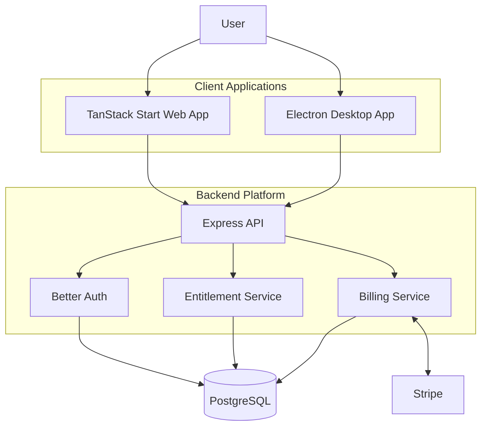
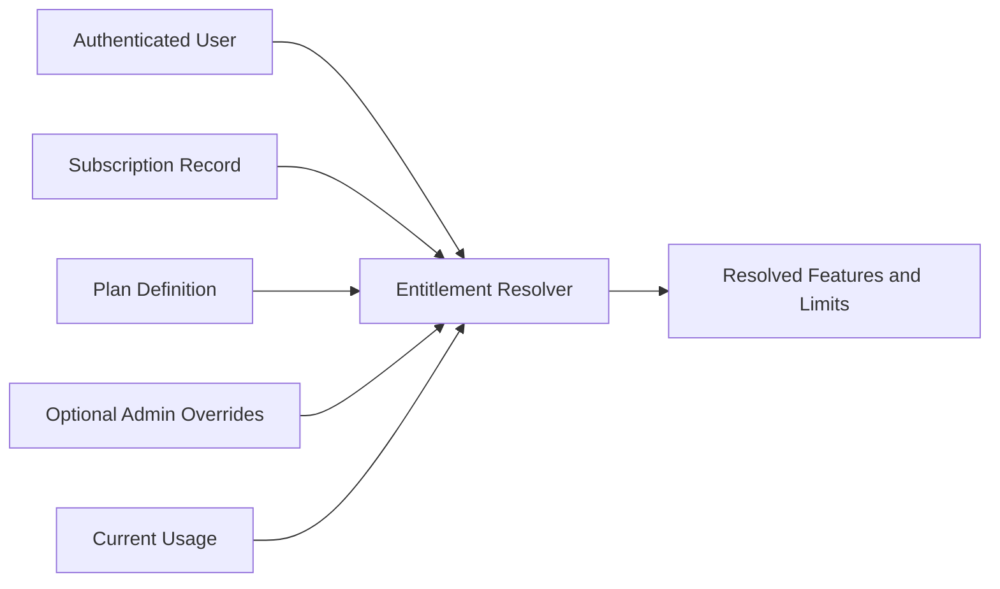
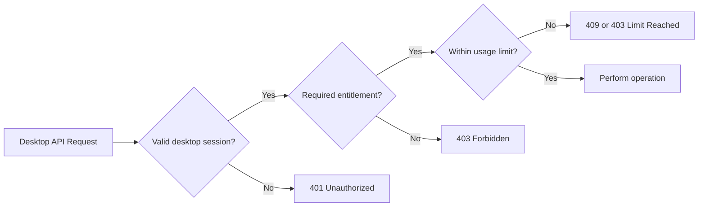
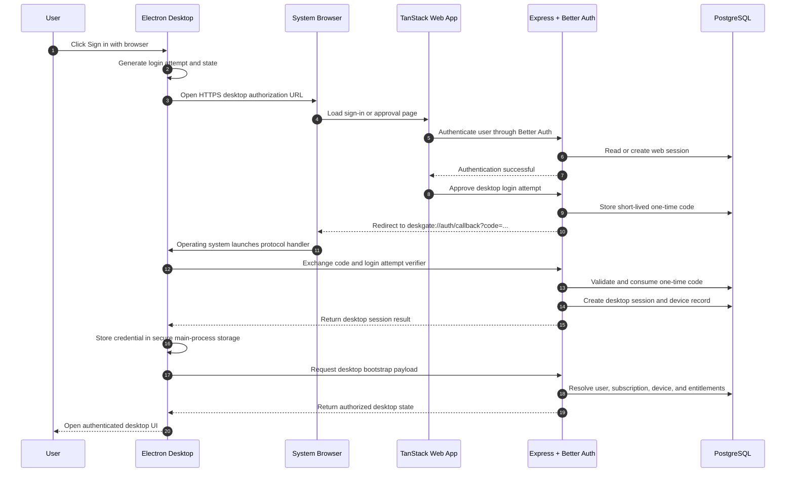
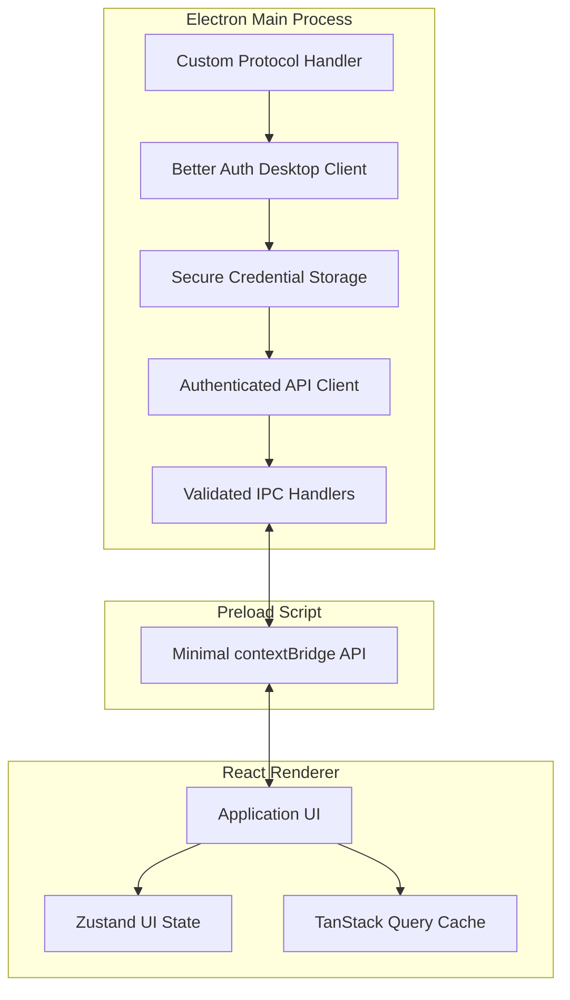
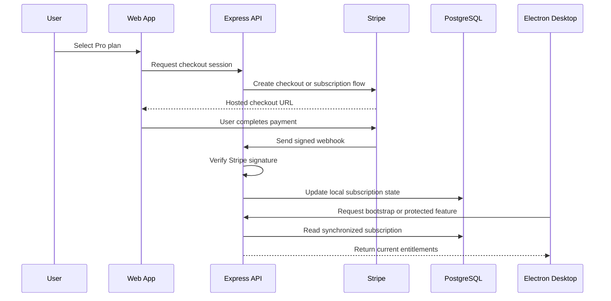
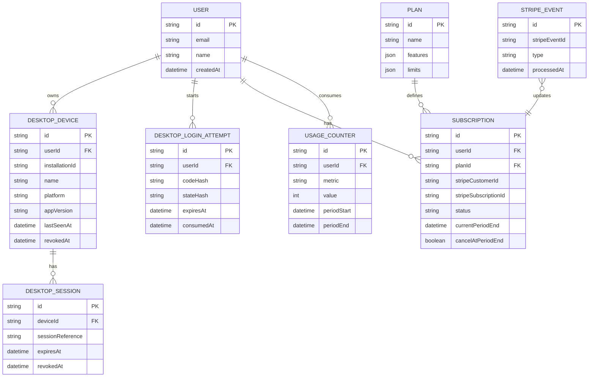
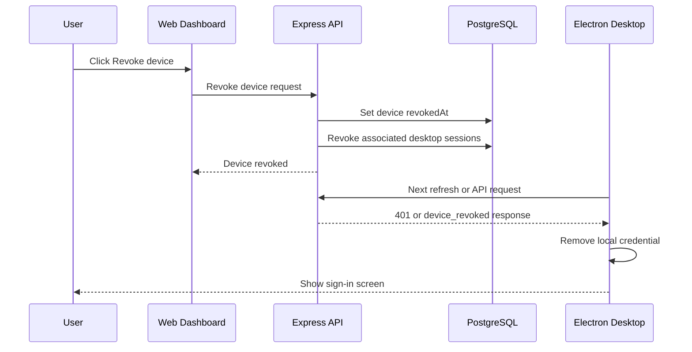

# DeskGate — Project Goal and Architecture

## 1. Project Overview

**DeskGate** is a learning-focused SaaS project designed to demonstrate how a web application can sell, authenticate, license, and control access to a desktop application.

The project models a common commercial desktop software workflow:

1. A user creates an account through the web application.
2. The user purchases a subscription through Stripe.
3. The user downloads and installs the Electron desktop application.
4. The desktop application authenticates the user through the system browser.
5. The backend verifies the user's subscription and returns their available features and limits.
6. The desktop application enables only the features included in the user's current plan.

DeskGate does not need to solve a real-world end-user problem. Its purpose is to teach the architecture, security boundaries, and implementation patterns used by subscription-based desktop products.

---

## 2. Learning Goals

The project should provide practical experience with:

- Building a TypeScript monorepo with pnpm workspaces.
- Sharing types, validation schemas, configuration, and authorization rules between applications.
- Authenticating an Electron application using a web-based sign-in flow.
- Opening the user's system browser from Electron.
- Returning control to Electron through a custom URL protocol.
- Exchanging a short-lived authorization code for a desktop session.
- Keeping authentication credentials out of the Electron renderer process.
- Using Better Auth as the centralized identity and session system.
- Integrating Stripe through the Better Auth Stripe plugin.
- Synchronizing subscription changes through Stripe webhooks.
- Modeling plans, limits, and feature entitlements.
- Enforcing paid features on the backend rather than trusting the desktop UI.
- Registering and revoking desktop devices.
- Handling canceled subscriptions, failed payments, expired sessions, and offline states.

---

## 3. Technology Stack

| Area                  | Technology                           |
| --------------------- | ------------------------------------ |
| Package manager       | pnpm                                 |
| Monorepo              | pnpm workspaces                      |
| Language              | TypeScript                           |
| Backend API           | Express.js                           |
| Web application       | TanStack Start                       |
| UI components         | shadcn/ui                            |
| Desktop application   | Electron                             |
| Authentication        | Better Auth                          |
| Billing               | Stripe and Better Auth Stripe plugin |
| ORM                   | Prisma                               |
| Database              | PostgreSQL                           |
| Validation            | Zod                                  |
| Client state          | Zustand                              |
| Server-state fetching | TanStack Query, where useful         |

---

## 4. Core Architectural Principle

The web application and desktop application are two clients of the same backend identity, billing, and authorization system.

The Electron application must not maintain an independent user database or independently decide which subscription a user owns.

The backend remains the source of truth for:

- User accounts
- Authentication sessions
- Stripe customers
- Subscriptions
- Plan definitions
- Feature entitlements
- Usage limits
- Registered desktop devices
- Device revocation
- Account suspension
- Minimum supported desktop versions



---

## 5. Proposed Monorepo Architecture

```text
deskgate/
├── apps/
│   ├── api/
│   │   ├── src/
│   │   │   ├── app.ts
│   │   │   ├── server.ts
│   │   │   ├── config/
│   │   │   ├── middleware/
│   │   │   ├── modules/
│   │   │   │   ├── auth/
│   │   │   │   ├── billing/
│   │   │   │   ├── desktop/
│   │   │   │   ├── devices/
│   │   │   │   ├── entitlements/
│   │   │   │   └── users/
│   │   │   └── routes/
│   │   └── package.json
│   │
│   ├── web/
│   │   ├── src/
│   │   │   ├── routes/
│   │   │   ├── components/
│   │   │   ├── features/
│   │   │   │   ├── account/
│   │   │   │   ├── billing/
│   │   │   │   ├── devices/
│   │   │   │   └── downloads/
│   │   │   └── lib/
│   │   └── package.json
│   │
│   └── desktop/
│       ├── src/
│       │   ├── main/
│       │   │   ├── index.ts
│       │   │   ├── auth/
│       │   │   ├── api/
│       │   │   ├── deep-links/
│       │   │   ├── ipc/
│       │   │   ├── storage/
│       │   │   └── windows/
│       │   ├── preload/
│       │   │   └── index.ts
│       │   └── renderer/
│       │       ├── app/
│       │       ├── components/
│       │       ├── features/
│       │       ├── stores/
│       │       └── lib/
│       └── package.json
│
├── packages/
│   ├── auth/
│   │   ├── src/
│   │   │   ├── server.ts
│   │   │   ├── client.ts
│   │   │   └── plugins.ts
│   │   └── package.json
│   │
│   ├── database/
│   │   ├── prisma/
│   │   │   ├── schema.prisma
│   │   │   └── migrations/
│   │   ├── src/
│   │   │   └── client.ts
│   │   └── package.json
│   │
│   ├── contracts/
│   │   ├── src/
│   │   │   ├── auth.ts
│   │   │   ├── billing.ts
│   │   │   ├── desktop.ts
│   │   │   ├── devices.ts
│   │   │   └── entitlements.ts
│   │   └── package.json
│   │
│   ├── entitlements/
│   │   ├── src/
│   │   │   ├── plans.ts
│   │   │   ├── features.ts
│   │   │   ├── limits.ts
│   │   │   └── authorize.ts
│   │   └── package.json
│   │
│   ├── ui/
│   │   ├── src/
│   │   └── package.json
│   │
│   ├── config/
│   │   ├── eslint/
│   │   ├── typescript/
│   │   └── package.json
│   │
│   └── utils/
│       ├── src/
│       └── package.json
│
├── package.json
├── pnpm-workspace.yaml
├── pnpm-lock.yaml
├── tsconfig.json
└── .env.example
```

### 5.1 Application Responsibilities

#### `apps/api`

The Express application is responsible for:

- Hosting Better Auth server routes.
- Processing Better Auth Electron authentication exchanges.
- Receiving Stripe webhooks.
- Returning subscription and entitlement information.
- Registering desktop installations as devices.
- Revoking desktop sessions and devices.
- Authorizing paid API operations.
- Returning desktop bootstrap information.

#### `apps/web`

The TanStack Start web application is responsible for:

- Account creation and browser-based sign-in.
- Plan selection and Stripe Checkout initiation.
- Subscription management.
- Stripe Customer Portal access.
- Desktop application downloads.
- Displaying registered devices.
- Revoking devices.
- Completing desktop-browser authentication approval.

#### `apps/desktop`

The Electron application is responsible for:

- Starting browser-based authentication.
- Handling the custom protocol callback.
- Exchanging the temporary authorization code.
- Storing credentials securely in the main process.
- Fetching desktop bootstrap information.
- Displaying available and unavailable features.
- Refreshing subscription and entitlement state.
- Restricting the renderer to a small, typed IPC API.

### 5.2 Shared Package Responsibilities

#### `packages/auth`

Contains shared Better Auth configuration and helpers. Server-only secrets must never be exported into browser or renderer bundles.

#### `packages/database`

Contains the Prisma schema, migrations, generated Prisma client, and database connection helpers.

#### `packages/contracts`

Contains Zod schemas and TypeScript types for API requests, responses, IPC messages, bootstrap payloads, devices, and entitlements.

#### `packages/entitlements`

Contains plan-independent authorization rules such as:

```ts
can(entitlements, "sync:cloud");
can(entitlements, "export:advanced");
limit(entitlements, "projects");
limit(entitlements, "devices");
```

The applications should avoid scattered conditions such as:

```ts
if (plan === "PRO" || plan === "TEAM") {
  // ...
}
```

#### `packages/ui`

May contain reusable visual components that work in both the web app and Electron renderer. Business logic, authentication clients, and Electron-specific APIs should not be placed here.

---

## 6. Suggested Plan Model

DeskGate should begin with three plans that make feature and limit checks easy to observe during development.

| Capability                | Free |    Pro |      Team |
| ------------------------- | ---: | -----: | --------: |
| Desktop access            |  Yes |    Yes |       Yes |
| Maximum projects          |    2 |     25 | Unlimited |
| Cloud synchronization     |   No |    Yes |       Yes |
| Advanced export           |   No |    Yes |       Yes |
| Team collaboration        |   No |     No |       Yes |
| Maximum activated devices |    1 |      3 |        10 |
| Offline grace period      | None | 3 days |    7 days |

### 6.1 Plan Definitions

```ts
type PlanId = "free" | "pro" | "team";

type Feature =
  "desktop:access" | "sync:cloud" | "export:advanced" | "collaboration:team";

type Limit = "projects" | "devices" | "offlineGraceDays";
```

Example entitlement configuration:

```ts
const plans = {
  free: {
    features: {
      "desktop:access": true,
      "sync:cloud": false,
      "export:advanced": false,
      "collaboration:team": false,
    },
    limits: {
      projects: 2,
      devices: 1,
      offlineGraceDays: 0,
    },
  },
  pro: {
    features: {
      "desktop:access": true,
      "sync:cloud": true,
      "export:advanced": true,
      "collaboration:team": false,
    },
    limits: {
      projects: 25,
      devices: 3,
      offlineGraceDays: 3,
    },
  },
  team: {
    features: {
      "desktop:access": true,
      "sync:cloud": true,
      "export:advanced": true,
      "collaboration:team": true,
    },
    limits: {
      projects: null,
      devices: 10,
      offlineGraceDays: 7,
    },
  },
} as const;
```

A `null` numeric limit represents unlimited access.

### 6.2 Subscription State

Plan identity and subscription state must be modeled separately.

A user might have a `pro` subscription whose current state is not usable because payment failed or the subscription expired.

Suggested normalized subscription states:

```ts
type SubscriptionAccessStatus =
  "active" | "trialing" | "grace_period" | "past_due" | "canceled" | "expired";
```

Access rules can initially be:

| Subscription status | Paid feature access                                               |
| ------------------- | ----------------------------------------------------------------- |
| `active`            | Allowed                                                           |
| `trialing`          | Allowed                                                           |
| `grace_period`      | Allowed with warning                                              |
| `past_due`          | Product decision; normally temporary warning or restricted access |
| `canceled`          | Allowed until paid-through date, then denied                      |
| `expired`           | Denied                                                            |

### 6.3 Entitlement Resolution



The resolver should produce an application-friendly result:

```json
{
  "plan": "pro",
  "subscriptionStatus": "active",
  "features": {
    "desktop:access": true,
    "sync:cloud": true,
    "export:advanced": true,
    "collaboration:team": false
  },
  "limits": {
    "projects": 25,
    "devices": 3,
    "offlineGraceDays": 3
  },
  "usage": {
    "projects": 4,
    "devices": 1
  }
}
```

---

## 7. Authentication Versus Authorization

DeskGate must clearly separate three concepts.

### Authentication

Answers:

> Who is this user, and is their session valid?

Better Auth owns this responsibility.

### Subscription and entitlement resolution

Answers:

> What plan and capabilities currently belong to this user?

Stripe events, local subscription records, and the entitlement service own this responsibility.

### Authorization

Answers:

> May this user perform this particular action right now?

Express route guards and service-level checks own this responsibility.



The Electron renderer may hide unavailable controls, but the backend must repeat the authorization check for every valuable server-backed operation.

---

## 8. Real-World Desktop Authentication Flow

### 8.1 Why the System Browser Is Used

The desktop app should open the user's normal browser rather than embedding a password form inside Electron.

Benefits include:

- The user may already be signed in on the web.
- Password managers work normally.
- Social login and multifactor authentication remain in the browser.
- The Electron app never receives the user's password.
- Authentication UI stays centralized in the web application.
- Browser security controls remain available.

### 8.2 Custom Protocol

DeskGate should register a custom URL protocol:

```text
deskgate://
```

After authentication, the browser redirects to a callback such as:

```text
deskgate://auth/callback?code=SHORT_LIVED_ONE_TIME_CODE
```

The URL should contain a temporary authorization code, not a reusable session token.

### 8.3 Authorization Code Properties

The temporary code should be:

- Random and difficult to guess.
- Short-lived, such as one to five minutes.
- Single-use.
- Bound to the login attempt.
- Bound to the requesting desktop installation where practical.
- Invalidated immediately after exchange.

### 8.4 Complete Authentication Sequence



---

## 9. The Complete DeskGate Flow

```mermaid
flowchart TD
    START([User visits DeskGate website])
    ACCOUNT[Create account or sign in]
    AUTH_WEB[Better Auth creates browser session]
    PLAN[Choose Free, Pro, or Team]
    CHECKOUT[Open Stripe Checkout]
    PAYMENT{Payment successful?}
    WEBHOOK[Stripe sends signed webhook]
    SYNC[Backend stores subscription state]
    DOWNLOAD[User downloads desktop installer]
    INSTALL[Install and launch Electron app]
    DESKTOP_SESSION{Existing valid desktop session?}
    SIGNIN[Click Sign in with browser]
    BROWSER[System browser opens DeskGate authorization page]
    APPROVE[User signs in and approves desktop access]
    CALLBACK[Browser redirects to deskgate://auth/callback]
    EXCHANGE[Electron main process exchanges one-time code]
    DEVICE[Backend registers or updates device]
    STORE[Main process stores desktop credential securely]
    BOOTSTRAP[Desktop requests bootstrap payload]
    RESOLVE[Backend resolves subscription and entitlements]
    ACCESS{Desktop access entitlement active?}
    APP[Enable entitled desktop features]
    RESTRICT[Show restricted or subscription-required state]
    REFRESH[Periodically refresh session and entitlements]
    CHANGE{Subscription or device state changed?}
    UPDATE[Update desktop feature availability]

    START --> ACCOUNT
    ACCOUNT --> AUTH_WEB
    AUTH_WEB --> PLAN
    PLAN --> CHECKOUT
    CHECKOUT --> PAYMENT
    PAYMENT -- No --> PLAN
    PAYMENT -- Yes --> WEBHOOK
    WEBHOOK --> SYNC
    SYNC --> DOWNLOAD
    DOWNLOAD --> INSTALL
    INSTALL --> DESKTOP_SESSION

    DESKTOP_SESSION -- No --> SIGNIN
    SIGNIN --> BROWSER
    BROWSER --> APPROVE
    APPROVE --> CALLBACK
    CALLBACK --> EXCHANGE
    EXCHANGE --> DEVICE
    DEVICE --> STORE
    STORE --> BOOTSTRAP

    DESKTOP_SESSION -- Yes --> BOOTSTRAP
    BOOTSTRAP --> RESOLVE
    RESOLVE --> ACCESS
    ACCESS -- Yes --> APP
    ACCESS -- No --> RESTRICT

    APP --> REFRESH
    RESTRICT --> REFRESH
    REFRESH --> CHANGE
    CHANGE -- Yes --> UPDATE
    CHANGE -- No --> REFRESH
    UPDATE --> ACCESS
```



### 9.1 Numbered Product Flow

1. The user opens the DeskGate web application.
2. The user creates an account or signs in through Better Auth.
3. Better Auth creates a browser session.
4. The user chooses a subscription plan.
5. The web app starts Stripe Checkout through the Better Auth Stripe integration.
6. Stripe completes the payment and sends a signed webhook to the Express API.
7. The backend validates the webhook and updates the local subscription record.
8. The user downloads and installs the DeskGate Electron application.
9. On launch, Electron checks for an existing desktop session.
10. If no valid desktop session exists, the app opens the system browser.
11. The browser authenticates the user through the existing Better Auth web flow.
12. The user approves access for the desktop application.
13. The backend creates a short-lived, single-use authorization code.
14. The browser redirects to `deskgate://auth/callback?code=...`.
15. The Electron main process receives the callback.
16. The main process exchanges the temporary code for a desktop session.
17. The backend validates the code, creates or updates the device record, and consumes the code.
18. The main process stores the resulting credential using secure storage.
19. The desktop app requests its bootstrap payload.
20. The backend resolves the authenticated user, subscription state, device status, features, and limits.
21. The renderer displays the signed-in user and enables the included features.
22. The API repeats entitlement checks whenever a protected operation is requested.
23. The desktop app periodically refreshes session and entitlement state.
24. Stripe webhooks continue to synchronize upgrades, cancellations, payment failures, and renewals.
25. Device revocation or subscription changes are reflected during the next refresh or protected API request.

---

## 10. Electron Security Boundary

Electron contains three important layers:

1. Main process
2. Preload script
3. Renderer process

The main process should own authentication and privileged operations.



### 10.1 Main Process Responsibilities

- Open the system browser.
- Handle deep links.
- Store authentication credentials.
- Make privileged authenticated API calls.
- Validate IPC requests.
- Create and manage application windows.
- Remove credentials during sign-out or revocation.

### 10.2 Preload Responsibilities

Expose a small typed API, for example:

```ts
interface DeskGateDesktopApi {
  auth: {
    signIn(): Promise<void>;
    signOut(): Promise<void>;
    getSession(): Promise<PublicDesktopSession | null>;
  };
  account: {
    getBootstrap(): Promise<DesktopBootstrapResponse>;
    openBillingPortal(): Promise<void>;
  };
  app: {
    getVersion(): Promise<string>;
    getPlatform(): Promise<string>;
  };
}
```

The preload script must not expose:

- Raw session tokens
- Generic filesystem access
- Generic shell execution
- Unrestricted HTTP clients
- Arbitrary IPC invocation
- Node.js modules

### 10.3 Renderer Responsibilities

- Display authentication state.
- Display subscription and plan information.
- Enable or disable UI controls based on returned entitlements.
- Keep temporary UI state in Zustand.
- Cache public bootstrap data with TanStack Query where useful.

The renderer must not be treated as a trusted authorization environment.

---

## 11. Desktop Bootstrap Endpoint

A single bootstrap endpoint can provide the desktop application with everything required immediately after launch or sign-in.

Suggested route:

```http
GET /api/v1/desktop/bootstrap
```

Suggested response:

```json
{
  "user": {
    "id": "user_123",
    "name": "Kavinda",
    "email": "kavinda@example.com",
    "avatarUrl": null
  },
  "device": {
    "id": "device_123",
    "name": "Kavinda's Ubuntu PC",
    "platform": "linux",
    "appVersion": "0.1.0",
    "status": "active",
    "lastSeenAt": "2026-07-31T06:55:00.000Z"
  },
  "subscription": {
    "plan": "pro",
    "status": "active",
    "currentPeriodEnd": "2026-08-31T00:00:00.000Z",
    "cancelAtPeriodEnd": false
  },
  "entitlements": {
    "features": {
      "desktop:access": true,
      "sync:cloud": true,
      "export:advanced": true,
      "collaboration:team": false
    },
    "limits": {
      "projects": 25,
      "devices": 3,
      "offlineGraceDays": 3
    },
    "usage": {
      "projects": 4,
      "devices": 1
    }
  },
  "desktop": {
    "minimumSupportedVersion": "0.1.0",
    "latestVersion": "0.1.0",
    "updateRequired": false
  },
  "serverTime": "2026-07-31T06:55:00.000Z"
}
```

The endpoint should also update the device's `lastSeenAt` value.

---

## 12. Stripe Integration and Subscription Synchronization

The Electron application should never communicate directly with Stripe.



Important rules:

- Stripe is the source of billing events.
- PostgreSQL is the application's local source of subscription state.
- Webhooks synchronize Stripe into PostgreSQL.
- Desktop entitlement endpoints read from PostgreSQL.
- Protected routes should not call Stripe on every request.
- Webhook handlers must be idempotent.
- Stripe event IDs should be recorded to prevent duplicate processing.
- Webhook signatures must always be verified.

Events to handle include:

- Checkout completed
- Subscription created
- Subscription updated
- Subscription canceled or deleted
- Invoice paid
- Invoice payment failed
- Trial ending

---

## 13. Suggested Data Model

The exact Better Auth and Stripe plugin tables may be generated or managed by their integrations. DeskGate-specific data can conceptually include the following models.



### 13.1 Installation ID

On first launch, the desktop application should generate a random installation ID and store it in main-process storage.

It should not initially use aggressive hardware fingerprinting. Hardware identifiers can change, raise privacy concerns, and behave inconsistently across operating systems.

---

## 14. Session and Credential Storage

Credentials must not be stored in:

- `localStorage`
- Renderer Zustand state
- Renderer-accessible cookies
- Plain JSON files
- Source code
- Environment variables shipped with the desktop app

Preferred storage should use an operating-system-backed credential mechanism where possible, such as:

- macOS Keychain
- Windows Credential Manager
- Linux Secret Service or compatible keyring

If the Better Auth Electron integration provides a storage abstraction, DeskGate should connect it to an appropriate secure storage implementation.

Only public session information should cross IPC into the renderer.

---

## 15. Session Validation and Refresh

The desktop application should validate access at several points.

### At startup

- Load the locally stored credential.
- Validate or refresh the session.
- Request the bootstrap payload.
- Block paid features until the result is known.

### Periodically

For the learning version, refresh every 15 minutes while the application is active.

This detects:

- Subscription upgrades
- Subscription cancellation
- Payment failures
- Device revocation
- Account suspension
- Server-side session revocation

### Before protected server operations

Every protected API operation must perform fresh backend authorization based on the current session and entitlement state.

A cached bootstrap payload is for responsive UI, not final authorization.

---

## 16. Subscription Expiration and Restricted Mode

When the subscription becomes inactive, the application should not destroy or hide the user's local data.

A friendly restricted mode may:

- Keep existing projects readable.
- Disable creation beyond the current limit.
- Disable cloud synchronization.
- Disable advanced export.
- Disable team collaboration.
- Display the subscription problem.
- Provide a button that opens the web billing page or Stripe Customer Portal.

Example message:

> Your subscription is inactive. Your existing data remains available, but paid features are currently disabled.

---

## 17. Online and Offline Modes

### Phase 1: Online-required licensing

The first version should require connectivity to establish and periodically validate desktop access.

Benefits:

- Simpler implementation
- Immediate revocation
- Faster subscription synchronization
- Easier debugging
- No signed license files
- No clock-tampering logic

### Phase 2: Limited offline access

A later version may issue a signed offline entitlement document.

```json
{
  "userId": "user_123",
  "deviceId": "device_123",
  "plan": "pro",
  "features": ["desktop:access", "sync:cloud", "export:advanced"],
  "issuedAt": "2026-07-31T06:30:00.000Z",
  "validUntil": "2026-08-03T06:30:00.000Z"
}
```

The backend signs the document with a private key. The desktop app verifies it using an embedded public key.

Offline licensing adds complexity around:

- Clock rollback
- Key rotation
- Device binding
- Revocation delay
- Grace periods
- Expired licenses
- Reinstallations

It should therefore be implemented only after the online flow is complete.

---

## 18. Device Management

Each Electron installation should appear as a registered device.

Suggested device information:

- Installation ID
- User-selected or generated device name
- Operating system
- Desktop app version
- Creation time
- Last-seen time
- Revocation time
- Current session status

The web application should display devices and allow users to revoke them.



Plan device limits should be enforced when registering a new device.

---

## 19. Suggested API Surface

The exact Better Auth routes depend on its integration. DeskGate-specific routes can include:

### Desktop authentication

```http
POST /api/v1/desktop/auth/start
POST /api/v1/desktop/auth/exchange
POST /api/v1/desktop/auth/sign-out
```

### Desktop state

```http
GET /api/v1/desktop/bootstrap
POST /api/v1/desktop/heartbeat
```

### Devices

```http
GET    /api/v1/devices
PATCH  /api/v1/devices/:deviceId
DELETE /api/v1/devices/:deviceId
```

### Billing

```http
POST /api/v1/billing/checkout
POST /api/v1/billing/portal
POST /api/v1/billing/webhooks/stripe
GET  /api/v1/billing/subscription
```

### Example protected product operations

```http
POST /api/v1/projects
POST /api/v1/sync
POST /api/v1/exports/advanced
POST /api/v1/team/invitations
```

Each protected operation should declare its required feature or limit.

---

## 20. Error Model

The shared contracts package should define machine-readable errors.

```ts
type ApiErrorCode =
  | "UNAUTHENTICATED"
  | "SESSION_EXPIRED"
  | "DEVICE_REVOKED"
  | "DEVICE_LIMIT_REACHED"
  | "SUBSCRIPTION_REQUIRED"
  | "SUBSCRIPTION_INACTIVE"
  | "FEATURE_NOT_INCLUDED"
  | "USAGE_LIMIT_REACHED"
  | "DESKTOP_UPDATE_REQUIRED"
  | "INVALID_AUTHORIZATION_CODE"
  | "AUTHORIZATION_CODE_EXPIRED";
```

Example response:

```json
{
  "error": {
    "code": "FEATURE_NOT_INCLUDED",
    "message": "Advanced export is not included in your current plan.",
    "details": {
      "feature": "export:advanced",
      "plan": "free"
    }
  }
}
```

---

## 21. Security Requirements

DeskGate should follow these rules from the beginning:

- Use HTTPS for all production communication.
- Keep Better Auth secrets and Stripe secrets on the server only.
- Never place Stripe secret keys in the web or desktop application.
- Verify Stripe webhook signatures.
- Make webhook processing idempotent.
- Use short-lived, single-use desktop authorization codes.
- Validate the login state parameter during callback exchange.
- Do not send permanent credentials through custom protocol URLs.
- Store desktop credentials outside the renderer process.
- Enable Electron context isolation.
- Disable renderer Node.js integration.
- Use sandboxed renderers where compatible.
- Expose only narrow, typed preload APIs.
- Validate IPC senders and payloads.
- Validate all API input with Zod.
- Apply rate limits to login and exchange endpoints.
- Log security-relevant events without logging secrets.
- Re-check backend authorization for protected operations.
- Revoke desktop sessions when a device is revoked.

---

## 22. Recommended Implementation Milestones

### Milestone 1 — Monorepo foundation

- Create pnpm workspace.
- Add API, web, and desktop applications.
- Add shared TypeScript configuration.
- Add Prisma and PostgreSQL.
- Add shared Zod contracts.

### Milestone 2 — Web authentication

- Configure Better Auth.
- Implement account creation and sign-in.
- Add protected web routes.
- Display the signed-in user.

### Milestone 3 — Billing

- Configure Stripe test mode.
- Configure the Better Auth Stripe plugin.
- Create Free, Pro, and Team plans.
- Implement checkout.
- Implement webhook synchronization.
- Display current subscription state.

### Milestone 4 — Basic Electron application

- Create Electron main, preload, and renderer layers.
- Enable context isolation.
- Add typed IPC.
- Display app version and platform.
- Learn development and packaging workflows.

### Milestone 5 — Desktop browser authentication

- Register the `deskgate://` protocol.
- Open the system browser from Electron.
- Implement desktop login attempts.
- Handle the deep-link callback.
- Exchange a one-time code.
- Store credentials securely.

### Milestone 6 — Desktop bootstrap and entitlements

- Build the bootstrap endpoint.
- Resolve the plan and subscription status.
- Return features, limits, and usage.
- Gate renderer controls.
- Enforce the same permissions on the API.

### Milestone 7 — Device management

- Register devices.
- Enforce plan device limits.
- Display devices in the web dashboard.
- Revoke devices and sessions.

### Milestone 8 — Subscription lifecycle

- Handle upgrades and downgrades.
- Handle payment failures.
- Handle cancellation at period end.
- Implement restricted mode.
- Open the billing portal from Electron.

### Milestone 9 — Advanced topics

- Add offline grace periods.
- Add signed offline entitlement documents.
- Add desktop auto-update behavior.
- Add release signing and notarization.
- Add audit logs and security notifications.

---

## 23. Definition of Done

The learning project is complete when the following scenario works end to end:

1. A new user creates an account on the web.
2. The user subscribes to the Pro plan in Stripe test mode.
3. A Stripe webhook updates the local subscription state.
4. The user downloads and launches the Electron app.
5. Electron opens the system browser for authentication.
6. The browser redirects back through `deskgate://`.
7. Electron exchanges a one-time code and stores its session securely.
8. The desktop bootstrap endpoint returns the Pro entitlements.
9. Pro-only UI and API operations are available.
10. The user cancels or changes the subscription through the web.
11. The Stripe webhook updates the subscription.
12. The Electron app refreshes its entitlements and updates access.
13. The user revokes the device from the web dashboard.
14. The desktop session is rejected and the local app returns to the sign-in screen.

---

## 24. Initial Scope Decisions

To keep the first implementation manageable:

- Use Stripe test mode only.
- Require internet access for authentication and entitlement refresh.
- Support one account owner rather than organizations at first.
- Use random installation IDs rather than hardware fingerprinting.
- Keep the desktop product features intentionally simple.
- Focus on identity, billing, device sessions, and authorization.
- Delay offline licenses, code signing, notarization, and auto-updates until the core flow works.

---

## 25. Final Architecture Summary

DeskGate is a centralized SaaS platform with two clients:

- The web application owns account management, purchasing, subscription management, downloads, and device administration.
- The Electron application owns the installed desktop experience but relies on the backend for identity and authorization.

Better Auth authenticates users and manages sessions. Stripe manages billing events. PostgreSQL stores synchronized subscription and device state. The entitlement service translates a subscription into features and limits. Express enforces those entitlements for every protected server operation.

The key security boundary is that the Electron main process owns credentials and privileged operations, while the renderer receives only safe user and entitlement information through a restricted preload bridge.

This architecture provides a realistic foundation for learning how commercial desktop applications authenticate users and unlock subscription-based functionality.
